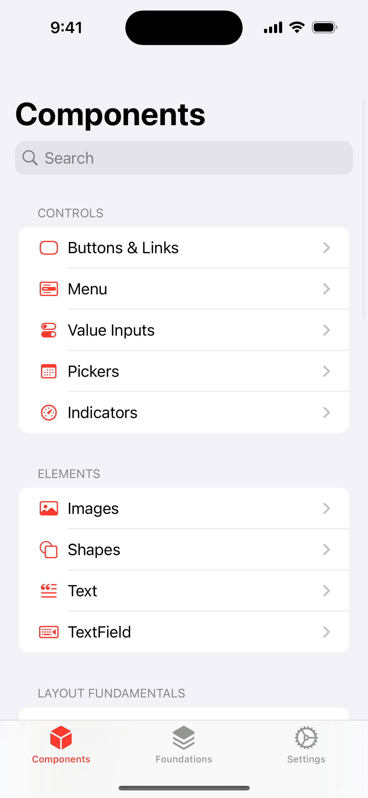
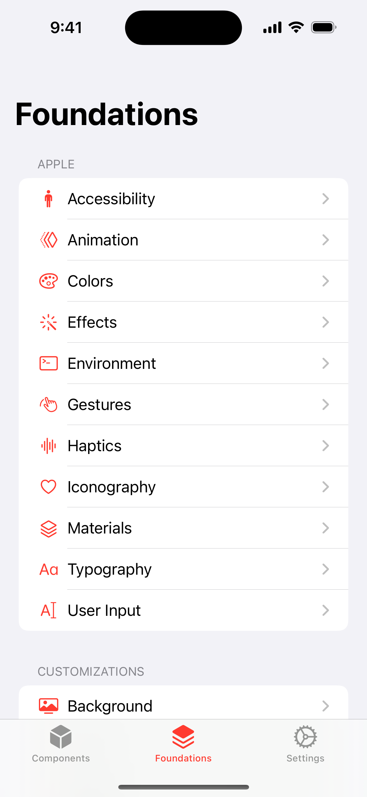
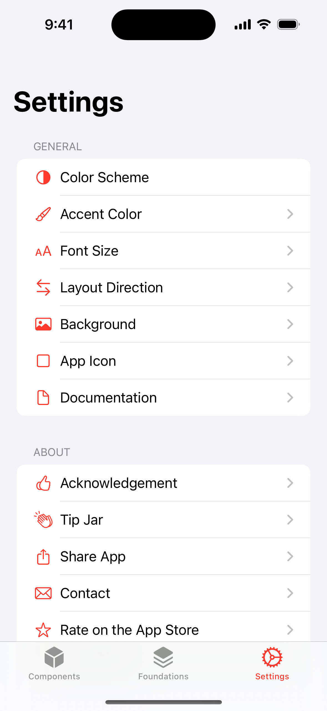
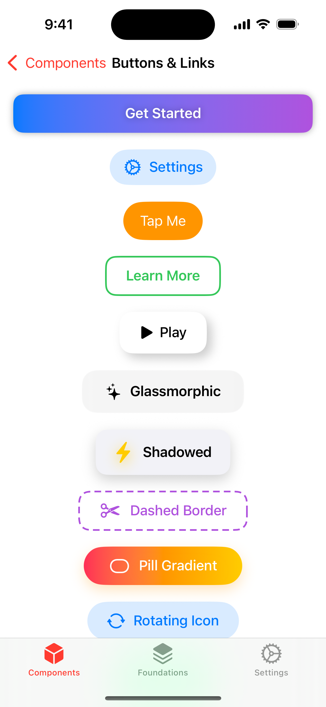
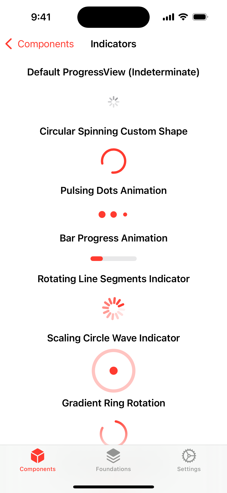
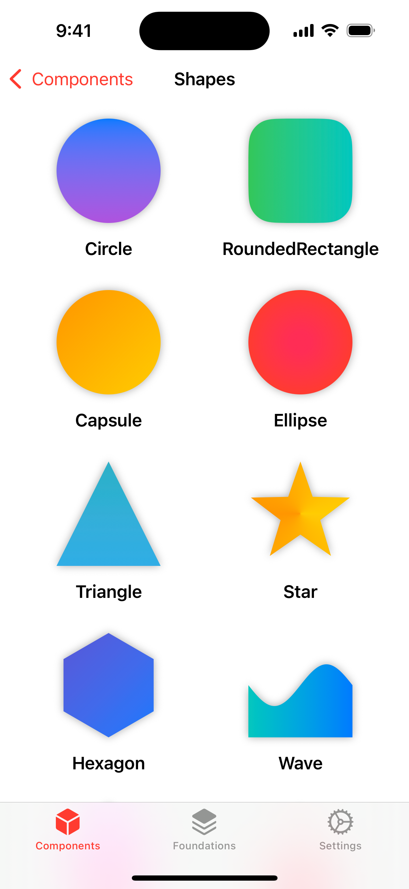
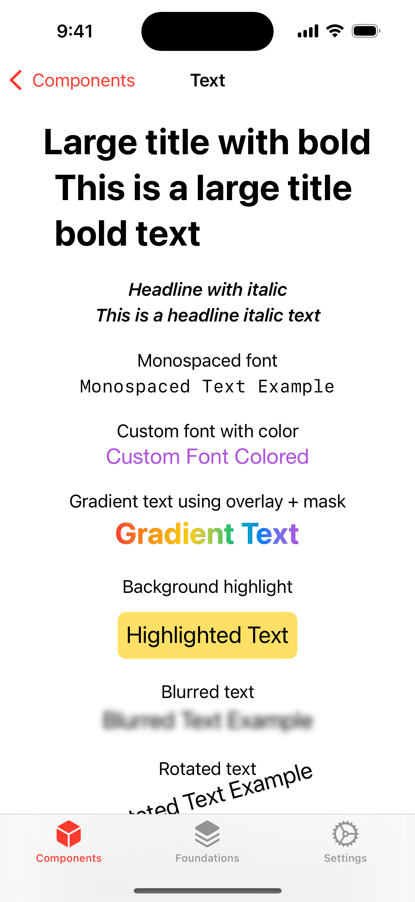
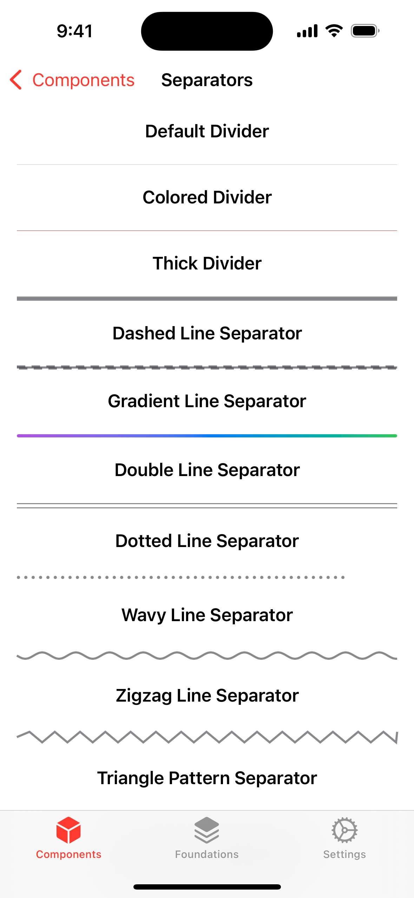
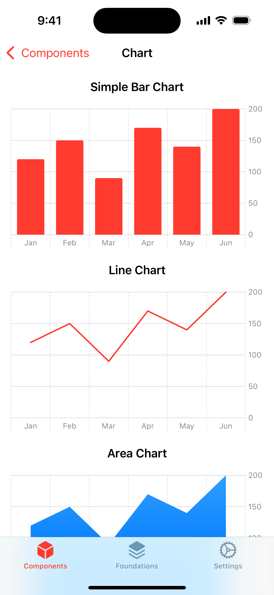

# Awesome SwiftUI Collections 🚀🎨

Welcome to **Awesome SwiftUI**! This is an open-source, curated list of the best SwiftUI resources, libraries, tutorials, and projects to help developers create stunning and functional apps effortlessly. Whether you’re a beginner or an experienced developer, this repository has something for everyone!

**Contributions are highly encouraged to help us make this list even more awesome!**

## Components

- UI Elements (Buttons, Lists, Pickers, etc.)
- Layouts & Containers
- Animations & Transitions
- Charts & Graphs
- Navigation
- Media (Images, Video, Audio)
- Other Useful Components

---

## Foundations

- Accessibility
- Animation
- Colors
- Effects
- Environment
- Gestures
- Haptics
- Iconography
- Materials
- Typography
- User Input

---

## Screenshots

| Screenshot             | Screenshot             | Screenshot             |
| ---------------------- | ---------------------- | ---------------------- |
|  |  |  |
|  |  |  |
|  |  |  |

## Contributing

Contributions are welcome! To add a new resource or improve this list:

1. **Fork** this repository.
2. **Add your resource** in the appropriate section with a short description.
3. **Submit a pull request** with your changes.

Please make sure your additions are valuable and relevant to the SwiftUI community. Thank you for helping us grow this collection!

## Credits

This project was made possible thanks to the heavy inspiration and resources from various contributors and communities on the internet. A special thanks goes out to:

- **[Amazing App(s) / Project(s)]**:

  - [Interactful](https://apps.apple.com/us/app/interactful/id1528095640) - An interactive guide for for SwiftUI to help designers and developers build better apps.
  - [Libraried: UI Components](https://apps.apple.com/us/app/libraried-ui-components/id1642862540) - This app is for Developers, Designers, and anyone who is curious about SwiftUI.

- **[Open-Source Libraries and Tools]**: This project leverages the incredible open-source work from the following libraries and tools:

  - [awesome-swiftui](https://github.com/vlondon/awesome-swiftui) - A list of articles, tutorials, guides and videos about SwiftUI and Combine.
  - [awesome-swiftui](https://github.com/chinsyo/awesome-swiftui) - A curated list of awesome SwiftUI tutorials, libraries, sessions and articles.

- **[Online Tutorials and Guides]**:

  - [Design+Code](https://designcode.io) - Learn design and code, by building real apps with React and Swift.
  - [Kavsoft](https://www.youtube.com/@Kavsoft) - Learn to design and code SwiftUI apps.
  - [Kodeco](https://designcode.io) - Learn iOS, Swift, Android, Kotlin, Flutter and Dart development.

- **[Open-Source Community]**: A huge thanks to the open-source community for their ongoing contributions, documentation, and support across various platforms like GitHub, StackOverflow, and Reddit.

If you believe I've overlooked a key contributor or resource, feel free to reach out or submit a pull request to add your name!

---
